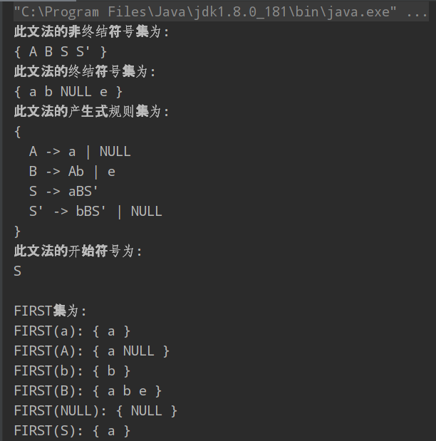
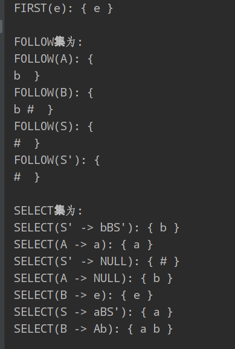

### 写在前面

编译原理课程的大作业，实现 pl0 的词法分析程序，语法分析程序，语义分析程序。

git地址为：https://github.com/HiHaker/PL0-compiler

### 词法分析程序的编写

#### 设计内容

处理 pl0 语言的源程序，过滤掉一些无用符号，如换行符，制表符，回车符，判断源程序中单词的合法性，分解出正确的单词，以一种二元式的形式（单词种别，单词自身的值）存储在文件中。

<u>单词符号</u>可以分为5种类别：**基本字、标识符、常数、运算符、界符**。

对于 pl0 语言：

- 基本字：`begin`，`end`，`if`，`then`，`while`，`do`，`const`，`var`，`call`，`procedure`，`odd`。
- 标识符：以字母开头，后面跟上字母或数字。
- 常数：数字的正闭包。
- 运算符：`+`，`-`，`*`，`/`，`:=`，`<`，`<=`，`>`，`>=`，`<>`，`=`，`#`。
- 界符：`,`，`.`，`;`，`(`，`)`。

词法分析程序应该完成以下的功能：滤空格、识别保留字、识别标识符、拼数、拼复合词。

##### 首先对程序中出现的单词符号做一个编码

|        单词符号         | 种别码 |
| :---------------------: | :----: |
|         `begin`         |   1    |
|          `end`          |   2    |
|          `if`           |   3    |
|         `then`          |   4    |
|         `while`         |   5    |
|          `do`           |   6    |
|         `const`         |   7    |
|          `var`          |   8    |
|         `call`          |   9    |
|       `procedure`       |   10   |
|          `odd`          |   11   |
| `letter(letter|digit)*` |   12   |
|      `digitdigit*`      |   13   |
|           `+`           |   14   |
|           `-`           |   15   |
|           `*`           |   16   |
|           `/`           |   17   |
|          `:=`           |   18   |
|           `<`           |   19   |
|          `<=`           |   20   |
|           `>`           |   21   |
|          `>=`           |   22   |
|          `<>`           |   23   |
|           `=`           |   24   |
|           `#`           |   25   |
|           `,`           |   26   |
|           `;`           |   27   |
|           `(`           |   28   |
|           `)`           |   29   |
|           `:`           |   30   |
|           `.`           |   0    |

##### 读入源程序

```java
char[] source = new char[8000];
// 开启文件流，读入文件
try(BufferedReader reader = new BufferedReader(new FileReader("./src/source.txt"));){
            reader.read(source);
} catch(IOException e){
	e.printStackTrace();
}
```

##### 对源程序做预处理，去除掉注释、换行符等

对源程序做一个总体的扫描，当扫描到`\`，可能是单行注释，也可能是除号；扫描到`(`时，可能是括号，也可能是多行注释；当扫描到`\n`，`\t`，`\r`这些无用符号时，略过。

```java
// 首先，对输入源程序做预处理，处理掉注释、换行符、制表符等等
    public char[] preProcess(char[] source) throws IllegalArgumentException{
        // 构造一个临时数组存储预处理后的源程序
        char[] temp = new char[8000];
        int count = 0;

        // 逐个扫描源程序中的字符
        outLoop: for (int i=0; i<source.length; i++){
            switch (source[i]){
                // 去除单行注释
                case '/':
                    if (source[i+1] == '/'){
                        // 跳过单行注释
                        i = i+2;
                        // 跳过这一行，直到遇到回车换行
                        while (source[i] != '\n'){
                            i++;
                        }
                    } else{
                        temp[count++] = source[i];
                    }
                    break;
                // 去除多行注释
                case '(':
                    if (source[i+1] == '*'){
                        // 跳过多行注释符号
                        i = i+2;
                        // 当不满足匹配多行注释的时候，跳过
                        while (!(source[i] == '*' && source[i+1] == ')')){
                            i++;
                            // 检查有没有到程序的末尾
                            if (i >= source.length -2){
                                throw new IllegalArgumentException("源程序的注释不匹配!");
                            }
                        }
                        // 跳过多行注释符号
                        i = i+2;
                    } else{
                        temp[count++] = source[i];
                    }
                case '\n':
                case '\t':
                case '\r':
                    i++;
                    break;
                // 程序结束标志
                case '.':
                    temp[count++] = source[i];
                    break outLoop;
                default:
                    temp[count++] = source[i];
            }
        }

        // 设置源程序的长度为count
        this.length = count;
        return temp;
    }
```

下面就可以开始进行单词符号的识别了。

##### 构造编码表

使用map映射来构造一个单词的编码表：

```java
keyWords = new HashMap<>();
keyWords.put("begin", 1);
keyWords.put("end", 2);
...
keyWords.put(")", 29);
keyWords.put(":", 30);
```

##### 单词识别

首先要去除掉空格，主要分为三种情况：首字符为字母，首字符为数字，首字符为其他符号。

- 首字符为字母：判断是否全为字母，如果全为字母，就是保留字，否则就是标识符。
- 首字符为数字：判断是否全为数字，如果是，就是常数，否则就是非法单词。
- 首字符为其他：使用switch语句判断。

这里函数的参数为待分析代码的字符数组，分析的开始位置，`Token`为自定义的类，有`String`类型的值和`int`类型的值两个属性，标识识别出单词的值和种别码。

```java
// 识别单词符号
    public Token scanner(char[] code, int begin){
        // 我们知道，要识别的PL/0语言中的单词符号有这几个类别：
        // 保留字、标识符、常数、运算符和界符
        // 可以进一步粗分为3类，字母开头（保留字和标识符）数字开头（常数）其他

        // 存储当前识别的单词符号
        char[] token = new char[20];
        // 指向程序的索引
        int index1 = begin;
        // 指向存储单词的数组的索引
        int index2 = 0;

        // 除去单词前的空格
        while (code[index1] == ' '){
            index1++;
        }

        // 如果单词的首字符为字母
        if (Character.isLetter(code[index1])){
            // 当后续为字母或数字时存入
            while (Character.isLetter(code[index1]) || Character.isDigit(code[index1])){
                token[index2++] = code[index1++];
            }
            // 在map中查找，如果能查找到说明是保留字
            // 否则说明是标识符
            // 每次返回都要维护下index1
            this.setBegin(index1);
            return new Token(String.valueOf(token).trim(), this.keyWords.getOrDefault(String.valueOf(token).trim(), 12));

        } else if (Character.isDigit(code[index1])){
            // 如果首字符是数字
            while (Character.isDigit(code[index1])){
                token[index2++] = code[index1++];
            }
            this.setBegin(index1);
            return new Token(String.valueOf(token).trim(), 13);
        } else {
            switch (code[index1]){
                case ':':
                    if (code[index1 + 1] == '='){
                        this.setBegin(index1+2);
                        return new Token(":=", this.keyWords.get(":="));
                    } else {
                        this.setBegin(index1+1);
                        return new Token(":", this.keyWords.get(":"));
                    }
                case '<':
                    if (code[index1 + 1] == '='){
                        this.setBegin(index1+2);
                        return new Token("<=", this.keyWords.get("<="));
                    } else if(code[index1 + 1] == '>') {
                        this.setBegin(index1+2);
                        return new Token("<>", this.keyWords.get("<>"));
                    } else{
                        this.setBegin(index1+1);
                        return new Token("<", this.keyWords.get("<"));
                    }
                case '>':
                    if (code[index1 + 1] == '='){
                        this.setBegin(index1+2);
                        return new Token(">=", this.keyWords.get(">="));
                    } else{
                        this.setBegin(index1+1);
                        return new Token(">", this.keyWords.get(">"));
                    }
                case '+':
                case '-':
                case '*':
                case '/':
                case '=':
                case '#':
                case ',':
                case ';':
                case '(':
                case ')':
                    this.setBegin(index1+1);
                    return new Token(String.valueOf(code[index1]), this.keyWords.get(String.valueOf(code[index1])));
                case '.':
                    return new Token(".", 0);
                default:
                    return new Token("noneType", -1);
            }
        }

    }
```

至此，词法分析器已经完成。

完整代码见：`LexicalAnalysis.java`文件。

### LL1文法的判定

需要编写一个程序，判定一个给定的文法是不是LL1文法的，重点在于实现*文法的机内表示*以及*判定算法*。

关于文法的机内表示，终结符号集和非终结符号集可以用`Set<String>`来表示，为什么不使用 `Character`类呢？，主要考虑到一些符号是形如`E'`这样的，产生试集合可以使用一种数据结构，**映射**，一个左部对应一个右部列表，`Map<String, String[]>`。

首先定义好一些成员变量：

```java
// 存储文法的映射（产生式规则集合）
private Map<String, String[]> P;
// 文法的开始符号
private String start;
// 非终结符号集
private Set<String> nonEndChars;
// 终结符号集
private Set<String> endChars;

// FIRST集合
private Map<String, Set<String>> FIRST;
// FOLLOW集合
private Map<String, Set<String>> FOLLOW;
// SELECT集合
private Map<String, Set<String>> SELECT;
```

读取文法并且存储入映射：

```java
    // 存储文法
private void storeGrammar(String[] Vn, String[] Vt, String[] P, String start){

        this.nonEndChars = new HashSet<>();
        this.endChars = new HashSet<>();
        this.start = start;
        this.P = new HashMap<>();

        try{
            // 存储产生式
            for (String value : P) {
                // 分割左部、右部
                String[] split1 = value.split("->");
                // 分割右部的不同产生式
                String[] split2 = split1[1].split("\\|");
                this.P.put(split1[0], split2);
            }

            // 存储符号集
            Collections.addAll(nonEndChars, Vn);
            Collections.addAll(endChars, Vt);
        } catch (Exception e){
            System.out.println("输入文法有错误!");
            e.printStackTrace();
        }
    }
```

#### 计算FIRST集合

对于`FIRST(x)`集合，按照以下的处理方式计算：

- 如果x是终结符，`FIRST(x)`为`{x}`。
- 如果x是空串，`FIRST(x)`为`{空串}`。
- 如果x是非终结符，`x->Y1Y2Y3...`，逐步地从Y1计算起，如果Y1的FIRST集包含空串，将`FIRST(Y1)-空串`加入到`FIRST(X)`，继续计算`FIRST(Y2)`，... ，如果计算到某个符号`Yn`不包含空串，就结束计算。如果计算到最后一个符号也包含空串，也就是说`Y1Y2Y3...->空串`，则加入最后一个符号的FIRST集。

从以上处理方式我们看出，需要递归地进行处理，先写一个方法，递归的求出某符号的FIRST集：

```java
// 递归地计算某符号的FIRST
    private Set<String> FIRSTx(String x){

        Set<String> first = new HashSet<>();

        // 如果x是终结符，FIRST集就是它本身
        // 这里，空串也包含在终结符号里
        if (endChars.contains(x)){
            first.add(x);
            return first;
        } else {
            // 否则，就等于其右部各个符号的FIRST集相加
            String[] rightItems = P.get(x);
            // 遍历每一个右部
            for (String value : rightItems){
                List<String> cList = disassemble(value);

                // 如果右部的产生式是单个符号的，就直接加入到first集合
                if (cList.size() == 1){
                    first.addAll(FIRSTx(cList.get(0)));
                } else {
                    // 如果右部是多个符号，就看串首符号
                    for (int i=0; i<cList.size(); i++){
                        String character = cList.get(i);
                        // 如果是终结符，直接把它加入first集合
                        if (endChars.contains(character)){
                            first.add(character);
                            break;
                        } else {
                            // 如果是非终结符，就计算它的FIRST集
                            Set<String> cFirst = FIRSTx(character);
                            // 如果包含有空串，就要继续计算后一个符号的FIRST集
                            if (cFirst.contains("NULL")){
                                // 如果此时是最后一个符号了
                                // 就要把空串页加入进first集合
                                if (i == cList.size() - 1){
                                    first.addAll(cFirst);
                                } else {
                                    cFirst.remove("NULL");
                                    first.addAll(cFirst);
                                }
                            } else {
                                // 如果不包含空串，就不需要继续计算了
                                first.addAll(cFirst);
                                break;
                            }
                        }
                    }
                }
            }
            return first;
        }
    }
```

然后就可以很轻松地计算FIRST集：

```java
 // 计算FIRST集合
private void calculateFIRST(){

	FIRST = new HashMap<>();

	// 终结符号的FIRST集合就是它本身
	for (String value : endChars){
		Set<String> first = new HashSet<>();
         first.add(value);
         FIRST.put(value, first);
	}

	// 对于每个非终结符
	for (String value : nonEndChars){
         FIRST.put(value, FIRSTx(value));
	}

}
```

#### 计算FOLLOW集合

对于计算FOLLOW集合，按照以下的处理方式进行计算：

- 对于开始符号S，先将界符加入到其FOLLOW集中。
- 如果某个符号是一个句型的最右符号，就把界符加入到其FOLLOW集。
- 对于`A->aBp`，如果`p`不能推导出空串，就将`FIRST(p)`加入到B的FOLLOW集。
- 如果`p`能推导出空串，就将`FIRST(p)-空串`和`FOLLOW(A)`加入到B的FOLLOW集。

从以上处理方式也看出来，需要递归地处理：

```java
// 递归地计算非终结符的FOLLOW集合
    private Set<String> FOLLOWx(String x){
        // 在产生式中搜索所有非终结符出现的位置
        for (String character : nonEndChars){
            String[] rightItems = P.get(character);

            for (String item : rightItems){
                // 获取符号列表
                List<String> cList = disassemble(item);

                // 接下来，搜索当前查找的非终结符的位置
                for (int i=0; i<cList.size(); i++){
                    String nonEndChar = cList.get(i);
                    if (nonEndChar.equals(x)){
                        // 判断是否处于最右的位置
                        if (i < cList.size() - 1){
                            // 如果没在最右边的位置
                            // 下面循环判断后一个符号是否是非终结符
                            for (int j=i+1; j<cList.size(); j++){
                                String nextChar = cList.get(j);
                                if (nonEndChars.contains(nextChar)){
                                    // 如果是非终结符，查看其FIRST集是否包含空串
                                    Set<String> nextFirst = FIRST.get(nextChar);
                                    // 如果包含空串，并且此时这个符号是最后一个符号
                                    // 就要将其FIRST除去空串的集合加入FOLLOW集，且左部的FOLLOW集加入FOLLOW集
                                    if (nextFirst.contains("NULL")){
                                        // 判断是否是最后一个符号
                                        if (j == cList.size() - 1){
                                            Set<String> leftFOLLOW = FOLLOWx(character);
                                            Set<String> nextFirstExceptNULL = new HashSet<>(nextFirst);
                                            nextFirstExceptNULL.remove("NULL");
                                            addCharsToFOLLOW(leftFOLLOW, x);
                                            addCharsToFOLLOW(nextFirstExceptNULL, x);
                                        } else{
                                            Set<String> nextFirstExceptNULL = new HashSet<>(nextFirst);
                                            nextFirstExceptNULL.remove("NULL");
                                            addCharsToFOLLOW(nextFirstExceptNULL, x);
                                        }
                                    } else{
                                        // 如果不包含空串加入FIRST之后跳出循环
                                        addCharsToFOLLOW(nextFirst, x);
                                        break;
                                    }
                                } else{
                                    // 如果不是非终结符，把此符号加入到当前查找的非终结符的FOLLOW集中
                                    addCharToFOLLOW(nextChar, nonEndChar);
                                    break;
                                }
                            }
                        }
                    }
                }
            }
        }

        return FOLLOW.get(x);
    }
```

计算FOLLOW集的方法如下：

```java
  // 计算FOLLOW集合
    private void calculateFOLLOW(){

        FOLLOW = new HashMap<>();
        // 首先在开始符号的FOLLOW集中加入界符
        Set<String> startFollow = new HashSet<>();
        startFollow.add("#");
        FOLLOW.put(start, startFollow);

        for (String character : nonEndChars) {
            String[] rightItems = P.get(character);
            for (String item : rightItems) {
                // 获取符号列表
                List<String> cList = disassemble(item);
                String rightChar = cList.get(cList.size() - 1);
                // 如果最右的符号是非终结符，就要把界符加入到其FOLLOW集
                if (nonEndChars.contains(rightChar)) {
                    addCharToFOLLOW("#", rightChar);
                }
            }
        }

        System.out.println("FOLLOW集为: ");

        for (String character : nonEndChars){
            Set<String> follow = FOLLOWx(character);
            System.out.println("FOLLOW(" + character + "): { ");
            for (String value : follow){
                System.out.print(value + " ");
            }
            System.out.println(" }");
        }

    }
```

#### 计算SELECT集合

- 对于产生式`A->a`，如果符号串`a`能推出空串，`SELECT(A) = FIRST(a)-空串`并上`FOLLOW(A)`。

- 如果不能推导出，那么`SELECT(A) = FIRST(a)`。

```java
// 计算SELECT集
    private void calculateSELECT(){

        // 为true的话，说明右部可以推导出空串
        boolean situation;
        SELECT = new HashMap<>();

        // 遍历产生式
        for (Map.Entry<String, String[]> entry : P.entrySet()){
            String leftItem = entry.getKey();
            String[] rightItems = entry.getValue();

            // 遍历右部
            for (String item : rightItems){
                situation = false;
                // 分解串为符号
                List<String> characters = disassemble(item);

                Set<String> first = new HashSet<>();

                // 计算串的FIRST集
                for (int i=0; i<characters.size(); i++){
                    String character = characters.get(i);
                    Set<String> currentFIRST = FIRST.get(character);
                    if (currentFIRST.contains("NULL")){
                        // 如果最后一个符号也能推导出空串，说明右部可以推导出空串
                        if (i == characters.size()-1){
                            situation = true;
                            first.addAll(FIRST.get(character));
                            first.remove("NULL");
                        } else{
                            first.addAll(FIRST.get(character));
                            first.remove("NULL");
                        }
                    } else{
                        first.addAll(FIRST.get(character));
                        break;
                    }
                }

                String p = leftItem + " -> " + item;

                if (situation){
                    Set<String> follow = FOLLOW.get(leftItem);
                    first.addAll(follow);
                    SELECT.put(p, first);
                } else{
                    SELECT.put(p, first);
                }
            }
        }
    }
```





#### 判断是否是LL1文法

只要保证任意两条产生式的可选集不相交就说明是LL1文法。

```java
  // 判断是否是LL1文法
    public boolean isLL1(){

        boolean isIntersect = false;
        List<Set<String>> cList = new ArrayList<>(SELECT.values());

        outer:for (int i=0; i<cList.size(); i++){
            Set<String> set1 = cList.get(i);
            for (int j=i+1; j<cList.size(); j++){
                Set<String> set2 = cList.get(j);
                if (set1.retainAll(set2)){
                    break outer;
                } else{
                    set1 = cList.get(i);
                }
            }
        }

        return isIntersect;
    }
```

完整代码见`LL1Analysis文件`。